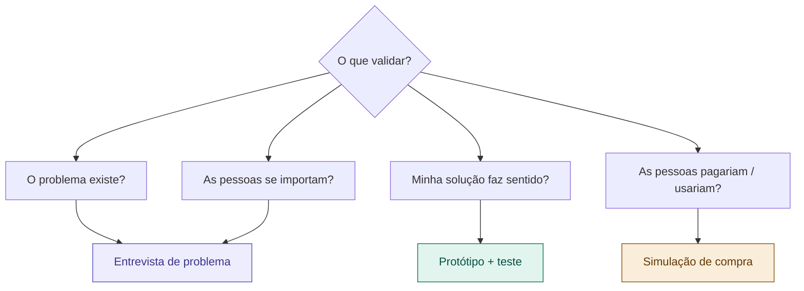

# 04 — Validação com Pessoas Reais

tags: #validação #pesquisa #entrevista #projeto
links: [[03 - Pesquisa e Benchmark]] | [[05 - Definir Escopo e Requisitos]] | [[🗺️ Mapa Principal]]

---

## O que é validação e por que é inegociável

Validar é **confirmar com evidências** que o problema existe, que o público se importa com ele e que a sua solução proposta faz sentido — antes de construir qualquer coisa.

A validação pode salvar semanas ou meses de trabalho. Um projeto não validado é uma aposta. Um projeto validado é uma hipótese testada.

> "Saia do prédio." — Steve Blank

Nenhuma pesquisa de computador substitui 10 conversas com pessoas reais do seu público.

---

## O que você precisa validar



---

## Etapa 1 — A entrevista de problema

Essa é a ferramenta mais poderosa e mais subutilizada. Você conversa com 5 a 10 pessoas do seu público-alvo para entender como elas vivem o problema — sem mencionar a sua solução ainda.

### Regras da entrevista de problema

```
✅ Fale sobre o passado, não sobre o futuro
   "Me conta a última vez que isso aconteceu" > "Você usaria um produto que..."

✅ Perguntas abertas
   "Como você lida com isso hoje?" > "Você usa algum app?"

✅ Escute mais do que fala
   Objetivo: 80% do tempo eles falam, 20% você faz perguntas

✅ Não defenda nem explique a ideia
   Você está aqui para aprender, não para convencer

✅ Anote emoções, não só respostas
   "Ficou com raiva ao descrever" é dado valioso
```

### Roteiro base de entrevista (30 minutos)

```markdown
## Abertura (2 min)
"Obrigado pelo seu tempo. Estou estudando como [público] lida com [tema].
Não vou vender nada — só quero entender melhor. Pode ser honesto."

## Contexto (5 min)
- "Me fala um pouco sobre sua rotina com [tema]"
- "Com que frequência você enfrenta esse tipo de situação?"

## O problema (15 min)
- "Pode me contar a última vez que [situação problema] aconteceu?"
- "O que você fez? Como você se sentiu?"
- "O que foi mais frustrante nessa situação?"
- "Como você resolve isso hoje?"
- "O que você não gosta na solução que usa?"

## Priorização (5 min)
- "Se você pudesse resolver só uma coisa nessa área, o que seria?"
- "Por que isso seria importante para você?"

## Fechamento (3 min)
- "Tem mais alguma coisa que eu não perguntei e que você acha relevante?"
- "Posso entrar em contato novamente se tiver mais dúvidas?"
```

---

## Etapa 2 — O protótipo de baixa fidelidade

Depois das entrevistas, você tem material para criar um protótipo. Ele **não precisa funcionar** — precisa ser bom o suficiente para gerar reação.

| Tipo de projeto | Protótipo adequado |
|---|---|
| App / sistema | Telas desenhadas no papel ou no Figma |
| Produto físico | Maquete, foam, impressão 3D rudimentar |
| Serviço | Simulação manual ("Mágico de Oz") |
| Evento | Flyer + landing page falsa para medir interesse |
| Campanha | Versão mínima do conteúdo / post de teste |

**Regra:** o protótipo serve para você aprender, não para impressionar. Quanto mais simples, mais rápido você aprende e itera.

---

## Etapa 3 — O teste de solução

Mostre o protótipo para as mesmas pessoas (ou pessoas similares) e observe:

```
✅ O que perguntar durante o teste:
- "O que você acha que esse [produto/serviço] faz?"
- "O que você faria primeiro?"
- "O que te confunde?"
- "Isso resolve o problema que você me descreveu antes?"
- "Você pagaria por isso? Quanto?"

❌ O que evitar:
- "Você gostou?" (resposta sempre é "sim" por educação)
- Explicar antes de observar
- Defender quando criticarem
```

---

## Como interpretar os resultados

### Sinais verdes — avance
- Pessoas descrevem o problema espontaneamente, com emoção
- Elas já tentam resolver de alguma forma (há urgência real)
- Ao ver o protótipo, dizem "eu precisava disso" sem você pedir
- Perguntam quando vai estar disponível

### Sinais amarelos — ajuste antes de avançar
- O problema existe, mas não incomoda tanto
- A solução proposta não ficou clara
- O público que testou é diferente do que você imaginou

### Sinais vermelhos — repense
- Ninguém reconhece o problema como importante
- Todos dizem "já uso X para isso e funciona bem"
- Nenhuma reação emocional ao descrever o problema
- As pessoas seriam educadas mas não usariam

---

## Quantas pessoas entrevistar?

| Fase | Quantidade | Motivo |
|---|---|---|
| Entrevistas de problema | 5 a 10 | Padrões surgem rapidamente |
| Teste de protótipo | 3 a 5 | Iterações rápidas |
| Validação de mercado | 20 a 50 | Mais confiança antes de investir |

> Com 5 entrevistas bem feitas, você já identifica os padrões principais. Mais do que 10 antes de iterar é desperdício.

---

## Próximas notas
- [[05 - Definir Escopo e Requisitos]] — transformar aprendizados em entregas
- [[06 - Riscos e Premissas]] — o que pode dar errado
