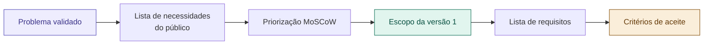

# 05 — Definir Escopo e Requisitos

tags: #validação #escopo #requisitos #planejamento
links: [[04 - Validação com Pessoas Reais]] | [[06 - Riscos e Premissas]] | [[08 - Planejamento e Cronograma]] | [[🗺️ Mapa Principal]]

---

## O que é escopo e por que ele importa tanto

**Escopo** é o conjunto exato do que o projeto vai entregar — e o que ele **não** vai entregar. É a fronteira entre o que está dentro e o que está fora.

Projetos sem escopo definido sofrem de **scope creep** — o escopo vai crescendo à medida que surgem novas ideias e pedidos, até o projeto nunca terminar.

> "Um projeto sem escopo definido nunca termina. Um projeto com escopo definido tem chances reais de ser entregue."

---

## Do problema ao escopo — o caminho



---

## Passo 1 — Liste tudo que o projeto poderia ser

Sem filtrar ainda, anote tudo que o projeto poderia incluir — baseado nas entrevistas, benchmarks e ideias do time:

```
Exemplo — projeto de organização de grupos acadêmicos:
- Criar tarefas e atribuir responsáveis
- Definir prazo para cada tarefa
- Enviar lembretes automáticos
- Chat entre os membros
- Votação para decidir abordagens
- Integração com Google Drive
- Conexão com o portal da faculdade
- Relatório de produtividade do grupo
- Avaliação entre os membros
- App mobile nativo
- Login com e-mail institucional
- Criação de templates de projetos
```

---

## Passo 2 — Priorize com MoSCoW

Classifique cada item em uma das quatro categorias:

| Label | Critério | Pergunta chave |
|---|---|---|
| **Must Have** | Sem isso o projeto não existe | "O projeto funciona sem isso?" |
| **Should Have** | Importante, mas não bloqueia | "As pessoas usariam sem isso?" |
| **Could Have** | Desejável se houver tempo | "É legal de ter, mas não urgente?" |
| **Won't Have** | Fora desta versão | "Podemos deixar para depois?" |

```
Exemplo classificado:
Must:   Criar tarefas, atribuir responsáveis, definir prazos, lembretes
Should: Chat interno, integração com Google Drive
Could:  Votação, templates de projetos
Won't:  App mobile, conexão com portal, avaliação entre membros
```

> **Regra de ouro:** se mais de 40% está no Must Have, você está com medo de cortar. Force uma conversa difícil.

---

## Passo 3 — Defina os requisitos

Para cada item do **Must Have**, detalhe o que exatamente precisa ser entregue:

### Requisito funcional (RF)
O que o projeto/produto **faz**.

```
RF01 — O usuário deve poder criar uma tarefa com título, descrição e prazo
RF02 — O criador do grupo pode atribuir cada tarefa a um ou mais membros
RF03 — Membros atribuídos recebem notificação por e-mail ao ser designados
RF04 — Cada membro pode marcar a tarefa como "Em andamento" ou "Concluída"
RF05 — O sistema exibe uma visão geral de todas as tarefas do grupo com status
```

### Requisito não-funcional (RNF)
Como o projeto **se comporta** — qualidade, não funcionalidade.

```
RNF01 — A plataforma deve funcionar em qualquer navegador moderno (Chrome, Firefox, Safari)
RNF02 — O tempo de carregamento das páginas deve ser inferior a 3 segundos
RNF03 — Os dados do grupo devem ser acessíveis apenas por membros autorizados
RNF04 — O sistema deve suportar até 30 usuários simultâneos (escala da turma)
```

---

## Passo 4 — Defina os critérios de aceite

Cada requisito precisa de um critério objetivo que diga quando ele está **concluído**. Sem isso, "pronto" é subjetivo.

```
RF01 — Critério de aceite:
✅ É possível criar uma tarefa via formulário com os 3 campos
✅ A tarefa aparece na lista do grupo após criação
✅ Tarefa sem prazo não pode ser salva (campo obrigatório)

RF03 — Critério de aceite:
✅ Membro recebe e-mail em até 5 minutos após ser atribuído
✅ O e-mail contém título da tarefa, prazo e link direto para o grupo
✅ Membros sem e-mail cadastrado não podem ser atribuídos
```

---

## O documento de escopo — resumo de 1 página

```
PROJETO: [Nome]
DATA: [Data]
TIME: [Membros]

OBJETIVO: [1 frase — o que o projeto entrega]

ESCOPO — O QUE ESTÁ DENTRO:
- [item 1]
- [item 2]
- [item 3]

FORA DO ESCOPO — O QUE NÃO SERÁ FEITO NESTA VERSÃO:
- [item 1]
- [item 2]

CRITÉRIO DE SUCESSO: [Como saberemos que o projeto funcionou?]

VERSÃO APROVADA POR: [nomes + data]
```

> Esse documento precisa ser assinado (ou confirmado por escrito) por todos os envolvidos. Muda de ideia no meio do projeto? Volta a este documento primeiro.

---

## Próximas notas
- [[06 - Riscos e Premissas]] — o que pode dar errado
- [[08 - Planejamento e Cronograma]] — quanto tempo cada item vai levar
