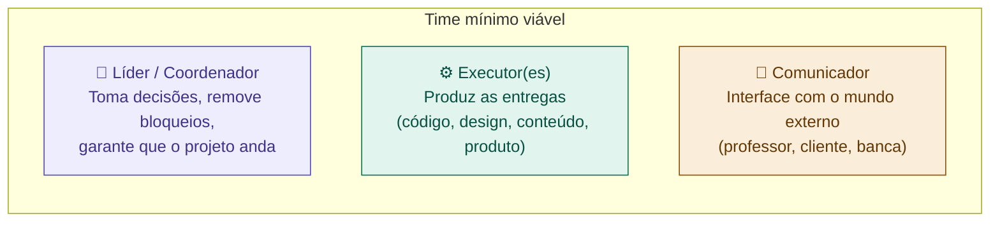

# 07 — Montar o Time

tags: #planejamento #time #pessoas #projeto
links: [[06 - Riscos e Premissas]] | [[08 - Planejamento e Cronograma]] | [[🗺️ Mapa Principal]]

---

## Time certo é diferente de time grande

Mais pessoas não significa mais velocidade. Um time pequeno com papéis claros entrega mais do que um time grande sem alinhamento.

> "Se eu precisar de mais de duas pizzas para alimentar o time, ele está grande demais." — Jeff Bezos

Para projetos acadêmicos e iniciantes: **2 a 4 pessoas** é o tamanho ideal. Acima disso, a coordenação começa a consumir mais energia do que a produção.

---

## Os papéis essenciais de qualquer projeto

Todo projeto precisa, minimamente, de alguém responsável por três coisas:



Em times pequenos, uma pessoa pode acumular papéis — mas cada papel precisa estar coberto por alguém.

---

## Matriz de responsabilidades — RACI

Para cada entregável do projeto, defina claramente:

| Letra | Significado | Quantas pessoas |
|---|---|---|
| **R** (Responsible) | Quem faz o trabalho | 1 por tarefa |
| **A** (Accountable) | Quem aprova / é cobrado | Só 1 por tarefa |
| **C** (Consulted) | Quem é consultado antes | Pode ser vários |
| **I** (Informed) | Quem é informado depois | Pode ser vários |

**Exemplo — projeto de app:**

| Entregável | Felipe | Maria | João | Professor |
|---|---|---|---|---|
| Definição de escopo | A | R | C | I |
| Protótipo visual | C | A | R | I |
| Desenvolvimento back-end | R | I | C | I |
| Apresentação final | A | R | R | — |
| Documentação técnica | C | I | R | I |

---

## Como definir quem faz o quê

### 1. Mapeie as habilidades do time
Peça que cada pessoa responda honestamente:

```
Nome: _______________

Sou bom em:        [lista de habilidades]
Quero aprender:    [lista de habilidades]
Prefiro evitar:    [lista de habilidades]
Disponibilidade:   [horas por semana]
```

### 2. Cruze com as necessidades do projeto
Liste as habilidades necessárias para cada entregável e associe às pessoas.

### 3. Distribua de forma equilibrada
Nenhuma pessoa deve ter mais do que 60% das responsabilidades críticas. Isso cria o *bus factor* — o risco de o projeto parar se essa pessoa sair.

---

## Combinados de time — defina antes de começar

Antes de qualquer código ou entrega, o time precisa combinar:

```
✅ Horário fixo de reunião semanal: [dia e hora]
✅ Canal de comunicação principal: [WhatsApp / Discord / Slack / outro]
✅ Onde ficam os arquivos: [Google Drive / Notion / GitHub]
✅ Como tomamos decisões? [consenso / maioria / líder decide]
✅ O que acontece se alguém não cumprir?
✅ Como tratamos desacordos técnicos?
✅ Qual é o protocolo se alguém precisar sair?
```

> Esses combinados parecem óbvios no início. São exatamente eles que evitam conflitos no meio do projeto.

---

## O contrato de time (para projetos acadêmicos)

Para projetos da faculdade, um documento simples assinado por todos previne muitos conflitos:

```markdown
## Contrato de Time — [Nome do Projeto]

**Membros:** [nomes]
**Data:** [data]

Nós, abaixo assinados, nos comprometemos a:

1. Comparecer às reuniões combinadas ou avisar com antecedência
2. Entregar as tarefas atribuídas nos prazos acordados
3. Comunicar dificuldades antes que virem bloqueios
4. Tratar feedbacks de forma construtiva
5. Documentar decisões tomadas em reunião

**Assinaturas:** _____ / _____ / _____
```

---

## Próximas notas
- [[08 - Planejamento e Cronograma]] — quando cada entrega vai acontecer
- [[14 - Comunicação no Time]] — como manter o time alinhado durante a execução
