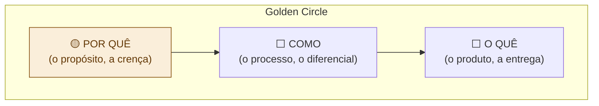

# 11 — Storytelling do Projeto

tags: #pitch #storytelling #narrativa #persuasão
links: [[10 - Anatomia de um Pitch]] | [[12 - Apresentação Visual]] | [[🗺️ Mapa Principal]]

---

## Por que storytelling funciona

Fatos informam. Histórias convencem.

O cérebro humano processa narrativas de forma completamente diferente de listas e dados. Uma história ativa regiões do cérebro ligadas à emoção e à memória — dados sozinhos ativam só o processamento lógico.

> "As pessoas não compram o quê você faz. Elas compram o porquê você faz." — Simon Sinek

---

## A estrutura narrativa do projeto — o Golden Circle



A maioria das pessoas apresenta **de fora para dentro** (O quê → Como → Por quê). Os melhores pitches começam pelo **Por quê**.

```
❌ Fora para dentro:
"Criamos um app de gestão de grupos (O QUÊ)
que usa notificações automáticas (COMO)
porque acreditamos que ninguém deveria reprovar por falta de organização. (POR QUÊ)"

✅ De dentro para fora:
"Acreditamos que nenhum aluno deveria ser prejudicado por culpa de desorganização de grupo. (POR QUÊ)
Por isso criamos um sistema que assume a função de coordenação sem que ninguém precise ser o vilão. (COMO)
O resultado é o Taskio — um app que distribui tarefas e envia lembretes automaticamente. (O QUÊ)"
```

---

## O arco narrativo do projeto em 3 atos

### Ato 1 — O Mundo Antes (o problema)
Apresente o mundo como ele é hoje, com a dor que ele carrega. Seja específico e visual — não genérico.

```
"Era terça-feira, 23h, três dias antes da entrega. Pedro abre o WhatsApp do grupo
e percebe que das 7 tarefas combinadas, só 2 foram feitas. O grupo tinha se
reunido 3 vezes. Tinham falado muito. Mas ninguém tinha feito nada de verdade."
```

### Ato 2 — A Virada (a solução)
Apresente o que muda quando o seu projeto entra em cena. O herói não é você — é o usuário.

```
"Com o Taskio, na primeira reunião do grupo, em 10 minutos, cada pessoa sabe
exatamente o que deve fazer, quando deve entregar, e vai receber lembretes
sem que ninguém precise cobrar. Pedro não é mais o chato — o sistema é."
```

### Ato 3 — O Novo Mundo (o impacto)
Mostre o estado futuro — o que muda para as pessoas quando o problema é resolvido.

```
"Menos estresse. Menos conflito. Mais tempo focado no conteúdo do trabalho,
não na gestão de pessoas. E talvez — finalmente — um trabalho que todos
se orgulham de entregar."
```

---

## Técnicas narrativas de alto impacto

### 1. A persona específica
Em vez de "os usuários", use uma pessoa real com nome.

```
❌ "Os usuários frequentemente enfrentam..."
✅ "A Juliana, aluna do 3º período, todo semestre..."
```

### 2. O dado + a história
Combine o número com o humano por trás dele.

```
✅ "1 em cada 3 alunos já reprovou em trabalho em grupo.
    Para o Carlos, isso representou 6 meses a mais na faculdade
    e uma dívida de R$ 4.000 em mensalidades."
```

### 3. O contraste antes/depois
Mostre explicitamente o que muda.

```
ANTES: "Grupo de WhatsApp com 47 mensagens não lidas, 3 reuniões esquecidas
        e a entrega que vai acontecer pela metade."
DEPOIS: "Taskio: notificação enviada, tarefa marcada como concluída,
         grupo entrega tudo no prazo — pela primeira vez no semestre."
```

---

## Próxima nota
- [[12 - Apresentação Visual]] — slides que amplificam a narrativa
