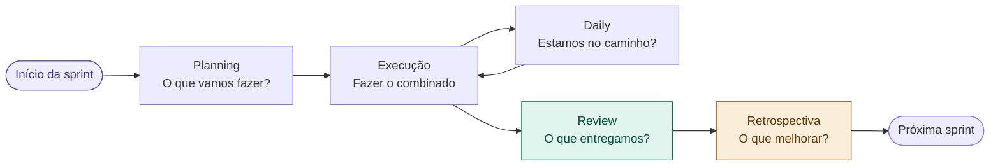

# 13 — Gestão de Tarefas e Sprints

tags: #execução #tarefas #sprints #gestão
links: [[08 - Planejamento e Cronograma]] | [[14 - Comunicação no Time]] | [[15 - Lidando com Bloqueios]] | [[🗺️ Mapa Principal]]

---

## A diferença entre planejamento e execução

Planejar é imaginar como o trabalho vai acontecer. Executar é fazer o trabalho acontecer de verdade — com todos os imprevistos, bloqueios e mudanças que o plano não previu.

A gestão de tarefas é a ponte entre os dois.

---

## O ciclo de sprint



---

## O board de tarefas — o coração da execução

Use um quadro Kanban simples com 4 colunas:

```
| BACKLOG        | A FAZER         | EM ANDAMENTO   | CONCLUÍDO      |
|----------------|-----------------|----------------|----------------|
| Tudo que ainda | O que está no   | O que alguém   | O que foi      |
| não foi        | escopo desta    | está fazendo   | entregue e     |
| priorizado     | sprint          | agora          | validado       |
```

**Ferramentas gratuitas:**
- **Trello** — mais simples, drag & drop intuitivo
- **Notion** — mais flexível, banco de dados completo
- **GitHub Projects** — integrado ao código
- **Papel na parede** — para trabalho presencial, funciona perfeitamente

---

## Anatomia de uma boa tarefa

Cada cartão de tarefa deve ter:

```
📌 Título: verbo + objeto ("Criar tela de login no Figma")
👤 Responsável: uma pessoa (não "o time")
📅 Prazo: data específica (não "semana que vem")
📝 Descrição: o que significa estar "pronto"
🔗 Dependências: o que precisa estar feito antes
```

---

## A daily de 15 minutos

Três perguntas, sem exceção, todo dia útil (ou a cada 2 dias no mínimo):

```
1. O que eu fiz desde a última daily?
2. O que vou fazer até a próxima?
3. Tem algum bloqueio que precisa de ajuda?
```

**Regras:**
- De pé, sem sentar (mantém curto)
- Não é reunião de status para o gestor — é sincronização do time
- Problemas complexos resolvem depois, não durante a daily

---

## Sinais de que a execução está descarrilando

| Sinal | O que significa | Ação |
|---|---|---|
| Tarefas ficam dias em "Em andamento" | Bloqueio não declarado | Conversa 1:1 com o responsável |
| Ninguém atualiza o board | Ferramenta não foi adotada | Simplificar ou trocar |
| Sempre tem "mais uma coisa" a adicionar | Scope creep ativo | Voltar ao documento de escopo |
| Daily demora mais de 20 min | Reunião virou resolução de problemas | Separar os dois momentos |
| Entregável pronto mas ninguém revisou | Falta de processo de review | Definir quem revisa o quê |

---

## Próximas notas
- [[14 - Comunicação no Time]] — manter o time alinhado
- [[15 - Lidando com Bloqueios]] — quando as coisas travam
