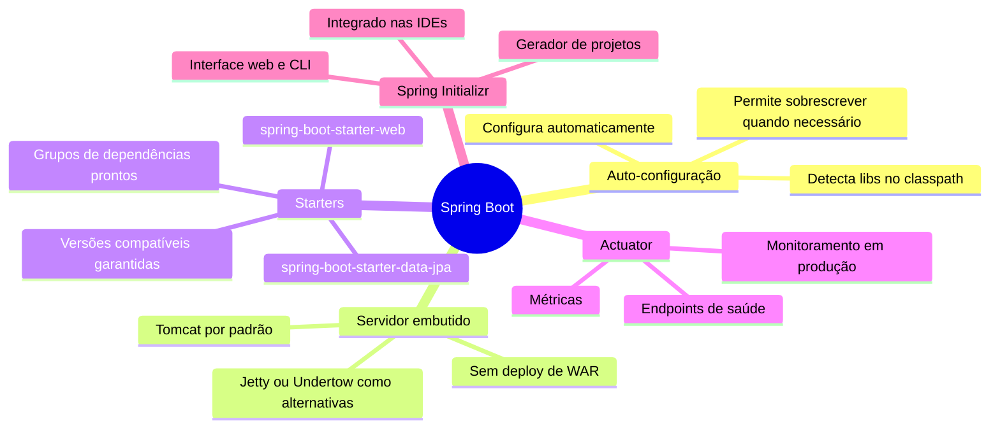

# 01 — O que é Spring Boot

tags: #springboot #fundamentos #java
links: [[02 - Spring vs Spring Boot vs Spring Framework]] | [[🗺️ Mapa Principal]]

---

## Definição direta

Spring Boot é um **framework Java para construção de aplicações prontas para produção** com configuração mínima. Ele pega todo o ecossistema do Spring Framework e elimina a maior parte da configuração manual que historicamente tornava o Spring difícil de usar.

> "Spring Boot faz com que seja fácil criar aplicações Spring standalone, de nível de produção, que você simplesmente executa."
> — Documentação oficial do Spring

Em termos práticos: você escreve a lógica da sua aplicação. O Spring Boot cuida do resto.

---

## O que ele resolve

Antes do Spring Boot (antes de 2014), criar uma aplicação Spring exigia:

- Configurar manualmente um servidor web (Tomcat, Jetty)
- Escrever dezenas de arquivos XML de configuração
- Gerenciar versões compatíveis de dezenas de dependências
- Configurar cada módulo do Spring separadamente

Isso tornava o tempo entre "ideia" e "aplicação rodando" **muito longo** — horas ou até dias só de setup.

Com Spring Boot:

```
$ spring init --dependencies=web,jpa,postgresql minha-api
$ cd minha-api
$ ./mvnw spring-boot:run
```

Em 3 comandos, você tem uma aplicação Java rodando com servidor web embutido, JPA configurado e pronta para conectar a um banco de dados.

---

## O que o Spring Boot entrega



---

## Por que Java + Spring Boot no mercado

| Critério | Detalhe |
|---|---|
| **Adoção empresarial** | Amplamente usado em bancos, fintechs, e-commerce, saúde |
| **Maturidade** | Spring existe desde 2003, Spring Boot desde 2014 |
| **Ecossistema** | Módulos para tudo: segurança, mensageria, cache, cloud |
| **Desempenho** | JVM moderna com JIT tem performance competitiva com Go e Node |
| **Salários** | Entre os mais altos do mercado de backend no Brasil |
| **Vagas** | Alta demanda, especialmente em empresas maiores |

---

## O primeiro "Hello World" com Spring Boot

Este é o menor programa possível que cria uma API REST funcional:

```java
// Arquivo: src/main/java/com/exemplo/MinhaApi.java

package com.exemplo;

import org.springframework.boot.SpringApplication;
import org.springframework.boot.autoconfigure.SpringBootApplication;
import org.springframework.web.bind.annotation.GetMapping;
import org.springframework.web.bind.annotation.RestController;

// @SpringBootApplication combina 3 anotações:
// @Configuration + @EnableAutoConfiguration + @ComponentScan
@SpringBootApplication
@RestController
public class MinhaApi {

    public static void main(String[] args) {
        // Inicia o servidor embutido e sobe a aplicação
        SpringApplication.run(MinhaApi.class, args);
    }

    @GetMapping("/")
    public String hello() {
        return "Olá, mundo!";
    }
}
```

Ao executar, o Spring Boot:
1. Detecta o Tomcat no classpath e o inicia na porta 8080
2. Detecta a anotação `@RestController` e registra a rota
3. Sua API está disponível em `http://localhost:8080/`

---

## Como o auto-configure funciona (conceito)

O Spring Boot escaneia o classpath. Se encontrar, por exemplo, a biblioteca `spring-boot-starter-data-jpa` (que inclui Hibernate), ele automaticamente:

- Configura o `EntityManagerFactory`
- Configura o `TransactionManager`
- Habilita repositórios JPA

Se você adicionar uma `DataSource` (conexão com banco), ele configura o pool de conexões automaticamente.

Tudo isso pode ser sobrescrito via `application.properties`. Você nunca perde controle — apenas ganha defaults inteligentes.

> ⚠️ **Erro comum:** iniciantes pensam que "mágica" é ruim. Não é — é convenção sobre configuração. Entenda os defaults, saiba onde estão, e sobrescreva apenas o necessário.

---

## Versões importantes

| Versão | Ano | Novidade principal |
|---|---|---|
| 1.0 | 2014 | Lançamento — auto-configuração, starters |
| 2.0 | 2018 | Suporte a programação reativa (WebFlux) |
| 2.7 | 2022 | Última série 2.x |
| 3.0 | 2022 | Java 17 mínimo, Jakarta EE 9, melhor suporte a nativo |
| 3.x | atual | Série ativa — use esta |

> 💡 **Para novos projetos em 2024+:** use Spring Boot 3.x com Java 21 (LTS). É o que o mercado está adotando.

---

## Próximas notas
- [[02 - Spring vs Spring Boot vs Spring Framework]] — entenda a diferença entre os termos
- [[03 - IoC e Injeção de Dependência]] — o conceito central do Spring
