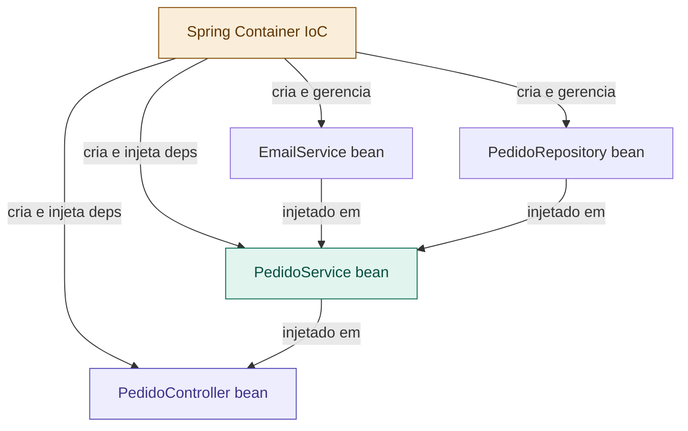

# 03 — IoC e Injeção de Dependência (DI)

tags: #springboot #fundamentos #ioc #di
links: [[02 - Spring vs Spring Boot vs Spring Framework]] | [[04 - O que é uma API REST]] | [[🗺️ Mapa Principal]]

---

## Por que isso é o conceito mais importante do Spring

Todo o Spring é construído sobre dois princípios: **Inversão de Controle (IoC)** e **Injeção de Dependência (DI)**. Sem entender esses dois conceitos, você usa Spring por "mágica" — e mágica que você não entende se torna um problema na hora de debugar.

---

## O problema que IoC resolve

Suponha que você tem uma classe `PedidoService` que precisa de um `EmailService` para enviar confirmações:

```java
// ❌ Abordagem tradicional — sem IoC
public class PedidoService {

    // PedidoService cria e controla o EmailService
    private EmailService emailService = new EmailService();

    public void criarPedido(Pedido pedido) {
        // ... lógica do pedido ...
        emailService.enviar(pedido.getEmail(), "Pedido confirmado!");
    }
}
```

**Problemas desta abordagem:**

1. `PedidoService` está **acoplado** à implementação concreta de `EmailService`
2. Se quiser trocar por `SmsService`, precisa alterar `PedidoService`
3. Para testar `PedidoService`, precisa instanciar `EmailService` real (que pode enviar e-mail de verdade)
4. Se `EmailService` precisar de outras dependências, você precisa criá-las também

---

## Inversão de Controle (IoC)

**IoC** inverte quem é responsável por criar e gerenciar os objetos.

Sem IoC: **você** cria os objetos que sua classe precisa.
Com IoC: **o framework** (Spring) cria e gerencia os objetos para você.

O Spring tem um **Container IoC** — um gerenciador de objetos que:
- Cria as instâncias das classes
- Gerencia o ciclo de vida delas (criação, destruição)
- Injeta as dependências onde necessário
- Mantém um registro de todos os objetos gerenciados (**beans**)

---

## Injeção de Dependência (DI)

DI é **como** o IoC entrega as dependências. Em vez de a classe criar suas dependências, elas são "injetadas" de fora.

```java
// ✅ Com Injeção de Dependência
public class PedidoService {

    // Não cria — declara que precisa
    private final NotificacaoService notificacaoService;

    // O Spring injeta via construtor
    public PedidoService(NotificacaoService notificacaoService) {
        this.notificacaoService = notificacaoService;
    }

    public void criarPedido(Pedido pedido) {
        // ... lógica do pedido ...
        notificacaoService.notificar(pedido.getEmail(), "Pedido confirmado!");
    }
}
```

Agora `PedidoService` depende de `NotificacaoService` (uma interface), não de uma implementação concreta. Você pode injetar `EmailService`, `SmsService` ou `MockService` nos testes — sem mudar `PedidoService`.

---

## Beans — os objetos gerenciados pelo Spring

No Spring, qualquer objeto gerenciado pelo Container IoC é chamado de **bean**.

Para declarar um bean, você usa anotações:

```java
// @Component — uso genérico, marca qualquer classe como bean
@Component
public class EmailService implements NotificacaoService {
    public void notificar(String destino, String mensagem) {
        System.out.println("E-mail enviado para: " + destino);
    }
}

// @Service — semântica de serviço (regra de negócio)
@Service
public class PedidoService {
    private final NotificacaoService notificacaoService;

    public PedidoService(NotificacaoService notificacaoService) {
        this.notificacaoService = notificacaoService;
    }
}

// @Repository — semântica de acesso a dados
@Repository
public class PedidoRepository {
    // acesso ao banco
}

// @Controller / @RestController — camada web
@RestController
public class PedidoController {
    // recebe requisições HTTP
}
```

> Todas essas anotações (`@Service`, `@Repository`, `@Controller`) são especializações de `@Component`. A diferença é semântica — ajudam a entender o papel da classe no sistema.

---

## As 3 formas de injeção

### 1. Injeção por construtor (✅ recomendada)

```java
@Service
public class PedidoService {

    // final garante que a dependência não muda após a criação
    private final PedidoRepository pedidoRepository;
    private final NotificacaoService notificacaoService;

    // Se só há um construtor, @Autowired é opcional no Spring Boot
    public PedidoService(PedidoRepository pedidoRepository,
                         NotificacaoService notificacaoService) {
        this.pedidoRepository = pedidoRepository;
        this.notificacaoService = notificacaoService;
    }
}
```

**Por que é a melhor?**
- Deixa as dependências explícitas
- Permite usar `final` (imutabilidade)
- Facilita testes (basta passar as dependências no construtor)
- Detecta dependências circulares em tempo de startup

### 2. Injeção por campo — Field Injection (❌ evitar)

```java
@Service
public class PedidoService {

    @Autowired  // Spring injeta diretamente no campo via reflexão
    private PedidoRepository pedidoRepository;

    @Autowired
    private NotificacaoService notificacaoService;
}
```

**Por que evitar?**
- Não é possível usar `final`
- Dificulta testes (precisa de reflexão ou do contexto Spring)
- Dependências ocultas — não ficam visíveis na assinatura
- Pode mascarar problemas de design (muitas dependências)

### 3. Injeção por setter (caso a caso)

```java
@Service
public class PedidoService {

    private NotificacaoService notificacaoService;

    @Autowired
    public void setNotificacaoService(NotificacaoService notificacaoService) {
        this.notificacaoService = notificacaoService;
    }
}
```

**Quando usar:** dependências opcionais que podem não estar presentes.

---

## Exemplo completo — como o Spring monta tudo

```java
// 1. Interface — o contrato
public interface NotificacaoService {
    void notificar(String destino, String mensagem);
}

// 2. Implementação — o bean concreto
@Service
public class EmailNotificacaoService implements NotificacaoService {
    @Override
    public void notificar(String destino, String mensagem) {
        // código real de envio de e-mail
        System.out.println("E-mail para " + destino + ": " + mensagem);
    }
}

// 3. Serviço que usa — Spring injeta EmailNotificacaoService aqui
@Service
public class PedidoService {

    private final PedidoRepository pedidoRepository;
    private final NotificacaoService notificacaoService;

    public PedidoService(PedidoRepository pedidoRepository,
                         NotificacaoService notificacaoService) {
        this.pedidoRepository = pedidoRepository;
        this.notificacaoService = notificacaoService;
    }

    public Pedido criarPedido(CriarPedidoRequest request) {
        Pedido pedido = new Pedido(request.getEmail(), request.getItens());
        pedidoRepository.save(pedido);
        notificacaoService.notificar(pedido.getEmail(), "Pedido #" + pedido.getId() + " confirmado!");
        return pedido;
    }
}

// 4. Controller — Spring injeta PedidoService aqui
@RestController
@RequestMapping("/pedidos")
public class PedidoController {

    private final PedidoService pedidoService;

    public PedidoController(PedidoService pedidoService) {
        this.pedidoService = pedidoService;
    }

    @PostMapping
    public ResponseEntity<Pedido> criar(@RequestBody CriarPedidoRequest request) {
        Pedido pedido = pedidoService.criarPedido(request);
        return ResponseEntity.status(201).body(pedido);
    }
}
```

O Spring lê as classes, detecta as anotações, cria os beans na ordem certa e injeta as dependências automaticamente. Você nunca escreve `new PedidoService(...)` no código de produção.

---

## Escopos de beans

Por padrão, beans são **Singleton** — o Spring cria uma única instância e reutiliza sempre.

| Escopo | Comportamento | Uso típico |
|---|---|---|
| `singleton` | Uma instância por contexto (padrão) | Services, repositories |
| `prototype` | Nova instância a cada injeção | Objetos com estado mutável |
| `request` | Uma por requisição HTTP | Dados específicos de uma request |
| `session` | Uma por sessão HTTP | Dados de sessão do usuário |

```java
// Mudando o escopo:
@Service
@Scope("prototype")
public class RelatorioService {
    // nova instância a cada vez que for injetado
}
```

> Para 99% dos casos, o escopo padrão (singleton) é o correto.

---

## Resumo visual



---

## Próximas notas
- [[04 - O que é uma API REST]] — o modelo que suas APIs vão seguir
- [[14 - RestController e RequestMapping]] — IoC na prática na camada web
