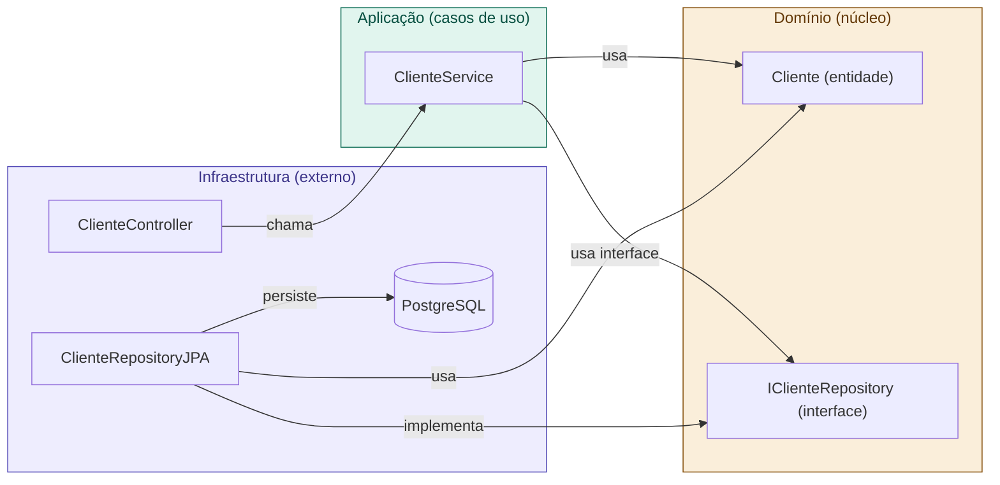

# 11 — Clean Architecture no Spring Boot

tags: #springboot #arquitetura #clean
links: [[10 - Arquitetura em Camadas]] | [[12 - Controller Service Repository Domain DTO]] | [[13 - Organização de Pacotes e Boas Práticas]] | [[🗺️ Mapa Principal]]

---

## Camadas vs Clean Architecture — qual a diferença?

A arquitetura em camadas simples tem um problema sutil: ela ainda acopla o Service ao Repository **concreto**. Se você decidir trocar de JPA para JDBC ou para uma API externa, precisa alterar o Service.

A Clean Architecture resolve isso com **inversão de dependência**: o Service define uma **interface** (contrato), e o Repository a implementa. O núcleo do sistema nunca conhece os detalhes de infraestrutura.



A seta crucial: `SVC → IFACE` (não `SVC → REPO`). O Service depende da **abstração**, não da implementação.

---

## Quando aplicar Clean Architecture no Spring Boot

Para projetos acadêmicos e de portfólio, a **arquitetura em camadas simples** (nota 10) já é suficiente e adequada. A Clean Architecture completa é mais indicada quando:

- O projeto vai crescer por meses/anos
- Há regras de negócio complexas que precisam de muito teste unitário
- É possível que banco, frameworks ou serviços externos mudem
- O time tem experiência com o padrão

> 💡 **Recomendação prática:** use a arquitetura em camadas para projetos pequenos e médios. Aplique os princípios da Clean Architecture (especialmente a inversão de dependência via interfaces) nas partes que mais mudam.

---

## Aplicando os princípios Clean no Spring Boot

### Estrutura de pacotes

```
src/main/java/com/empresa/minhaapi/
│
├── MinhaApiApplication.java
│
├── domain/                          ← Núcleo — zero deps externas
│   ├── model/
│   │   └── Cliente.java             ← Entidade de domínio
│   ├── repository/
│   │   └── ClienteRepository.java   ← Interface (contrato)
│   └── exception/
│       └── ClienteNaoEncontradoException.java
│
├── application/                     ← Casos de uso
│   └── cliente/
│       ├── ClienteService.java      ← Implementa os casos de uso
│       └── dto/
│           ├── ClienteRequest.java
│           └── ClienteResponse.java
│
├── infrastructure/                  ← Implementações concretas
│   ├── persistence/
│   │   ├── ClienteEntity.java       ← Entidade JPA (separada do domínio)
│   │   ├── ClienteJpaRepository.java ← Spring Data JPA interface
│   │   └── ClienteRepositoryImpl.java ← Implementa ClienteRepository
│   └── web/
│       └── ClienteController.java
│
└── config/                          ← Configurações Spring
    ├── SecurityConfig.java
    └── SwaggerConfig.java
```

### Exemplo completo — a inversão de dependência na prática

```java
// === DOMÍNIO ===

// Entidade de domínio — sem anotações JPA aqui na Clean Architecture pura
public class Cliente {
    private Long id;
    private String nome;
    private String email;
    private LocalDateTime criadoEm;

    public Cliente(String nome, String email) {
        if (nome == null || nome.isBlank()) throw new IllegalArgumentException("Nome obrigatório");
        if (!email.contains("@")) throw new IllegalArgumentException("E-mail inválido");
        this.nome = nome;
        this.email = email;
        this.criadoEm = LocalDateTime.now();
    }
    // getters...
}

// Contrato do repositório — fica no domínio
public interface ClienteRepository {
    Cliente salvar(Cliente cliente);
    Optional<Cliente> buscarPorId(Long id);
    Optional<Cliente> buscarPorEmail(String email);
    List<Cliente> listarTodos();
    void deletar(Long id);
    boolean existePorEmail(String email);
}
```

```java
// === APLICAÇÃO ===

@Service
public class ClienteService {

    // Depende da INTERFACE, não da implementação JPA
    private final ClienteRepository clienteRepository;
    private final EmailService emailService;

    public ClienteService(ClienteRepository clienteRepository, EmailService emailService) {
        this.clienteRepository = clienteRepository;
        this.emailService = emailService;
    }

    @Transactional
    public ClienteResponse criarCliente(ClienteRequest request) {
        if (clienteRepository.existePorEmail(request.getEmail())) {
            throw new EmailJaCadastradoException(request.getEmail());
        }
        var cliente = new Cliente(request.getNome(), request.getEmail());
        var salvo = clienteRepository.salvar(cliente);
        emailService.enviarBoasVindas(salvo.getEmail(), salvo.getNome());
        return ClienteResponse.from(salvo);
    }

    public ClienteResponse buscarPorId(Long id) {
        return clienteRepository.buscarPorId(id)
            .map(ClienteResponse::from)
            .orElseThrow(() -> new ClienteNaoEncontradoException(id));
    }
}
```

```java
// === INFRAESTRUTURA ===

// Entidade JPA (separada da entidade de domínio)
@Entity
@Table(name = "clientes")
public class ClienteEntity {

    @Id
    @GeneratedValue(strategy = GenerationType.IDENTITY)
    private Long id;

    @Column(nullable = false)
    private String nome;

    @Column(nullable = false, unique = true)
    private String email;

    @Column(name = "criado_em", nullable = false)
    private LocalDateTime criadoEm;

    // Conversão entre domínio e infraestrutura
    public static ClienteEntity from(Cliente cliente) {
        var entity = new ClienteEntity();
        entity.id = cliente.getId();
        entity.nome = cliente.getNome();
        entity.email = cliente.getEmail();
        entity.criadoEm = cliente.getCriadoEm();
        return entity;
    }

    public Cliente toDomain() {
        // reconstrói a entidade de domínio
        return Cliente.reconstituir(id, nome, email, criadoEm);
    }
}

// Interface Spring Data JPA
public interface ClienteJpaRepository extends JpaRepository<ClienteEntity, Long> {
    Optional<ClienteEntity> findByEmail(String email);
    boolean existsByEmail(String email);
}

// Implementação do contrato do domínio
@Repository
public class ClienteRepositoryImpl implements ClienteRepository {

    private final ClienteJpaRepository jpaRepository;

    public ClienteRepositoryImpl(ClienteJpaRepository jpaRepository) {
        this.jpaRepository = jpaRepository;
    }

    @Override
    public Cliente salvar(Cliente cliente) {
        var entity = ClienteEntity.from(cliente);
        var salvo = jpaRepository.save(entity);
        return salvo.toDomain();
    }

    @Override
    public Optional<Cliente> buscarPorId(Long id) {
        return jpaRepository.findById(id).map(ClienteEntity::toDomain);
    }

    @Override
    public boolean existePorEmail(String email) {
        return jpaRepository.existsByEmail(email);
    }

    // outros métodos...
}
```

---

## Abordagem pragmática: o meio-termo que o mercado usa

A Clean Architecture pura tem overhead (duas entidades, conversores). Para a maioria dos projetos, o mercado usa uma abordagem **pragmática**:

```java
// Entidade JPA usada diretamente como entidade de domínio (simplificação)
@Entity
@Table(name = "clientes")
public class Cliente {
    @Id @GeneratedValue(strategy = GenerationType.IDENTITY)
    private Long id;
    // campos...
}

// Repository estende JpaRepository diretamente (sem interface de domínio separada)
public interface ClienteRepository extends JpaRepository<Cliente, Long> {
    boolean existsByEmail(String email);
}

// Service depende do ClienteRepository (que é interface, então DI ainda funciona)
@Service
public class ClienteService {
    private final ClienteRepository repository;
    // ...
}
```

Esta abordagem mantém as **responsabilidades separadas** sem o overhead da Clean Architecture completa. É o que você vai encontrar em 80% dos projetos Spring Boot no mercado.

---

## Próximas notas
- [[12 - Controller Service Repository Domain DTO]] — cada camada em detalhe com código
- [[13 - Organização de Pacotes e Boas Práticas]] — estrutura de pacotes definitiva
