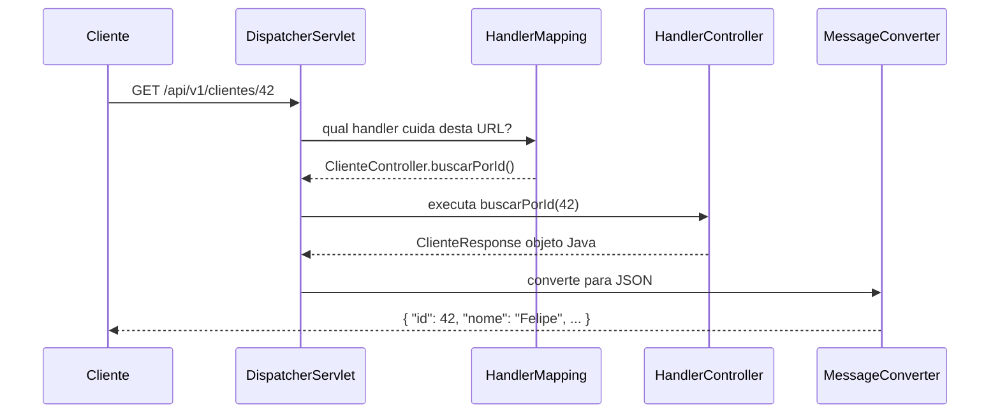

# 14 — @RestController e @RequestMapping

tags: #springboot #controllers #web #anotações
links: [[13 - Organização de Pacotes e Boas Práticas]] | [[15 - Métodos HTTP GET POST PUT DELETE]] | [[16 - PathVariable e RequestParam]] | [[🗺️ Mapa Principal]]

---

## @RestController — a anotação fundamental

`@RestController` é a anotação que transforma uma classe Java em um **handler de requisições HTTP** que retorna dados (JSON, XML) em vez de templates HTML.

```java
// @RestController = @Controller + @ResponseBody
// @Controller: registra a classe como bean Spring MVC
// @ResponseBody: serializa o retorno dos métodos para JSON automaticamente

@RestController  // ← uma anotação, dois efeitos
public class ProdutoController {

    @GetMapping("/produtos")
    public List<ProdutoResponse> listar() {
        // O Spring usa Jackson para converter a lista para JSON
        return service.listar();
    }
}
```

### Diferença entre @Controller e @RestController

```java
// @Controller — usado para retornar views (HTML com Thymeleaf, por ex.)
@Controller
public class PaginaController {

    @GetMapping("/home")
    public String home(Model model) {
        model.addAttribute("titulo", "Bem-vindo");
        return "home";  // retorna o nome do template, não o objeto
    }

    @GetMapping("/dados")
    @ResponseBody  // precisa de @ResponseBody para retornar JSON neste controller
    public List<String> dados() {
        return List.of("a", "b", "c");
    }
}

// @RestController — usado para APIs REST (sempre retorna dados)
@RestController  // @ResponseBody aplicado em TODOS os métodos automaticamente
public class ApiController {

    @GetMapping("/dados")
    public List<String> dados() {
        return List.of("a", "b", "c");  // sempre JSON
    }
}
```

---

## @RequestMapping — definindo URLs

`@RequestMapping` mapeia uma URL (ou padrão de URL) para uma classe ou método.

### Uso na classe — prefixo de todos os endpoints

```java
@RestController
@RequestMapping("/api/v1/clientes")  // prefixo para todos os métodos da classe
public class ClienteController {

    @GetMapping          // GET  /api/v1/clientes
    public Page<ClienteResponse> listar(...) { }

    @GetMapping("/{id}") // GET  /api/v1/clientes/{id}
    public ClienteResponse buscar(...) { }

    @PostMapping         // POST /api/v1/clientes
    public ClienteResponse criar(...) { }

    @PutMapping("/{id}") // PUT  /api/v1/clientes/{id}
    public ClienteResponse atualizar(...) { }

    @DeleteMapping("/{id}") // DELETE /api/v1/clientes/{id}
    public void deletar(...) { }
}
```

### Múltiplos prefixos e configurações avançadas

```java
@RequestMapping(
    value = "/api/v1/produtos",
    produces = MediaType.APPLICATION_JSON_VALUE,  // sempre retorna JSON
    consumes = MediaType.APPLICATION_JSON_VALUE   // só aceita JSON no body
)
public class ProdutoController { }

// Múltiplos paths no mesmo método (evite — use para compatibilidade)
@GetMapping({"/produtos", "/items"})
public List<Produto> listar() { ... }
```

---

## As anotações de método — atalhos para @RequestMapping

```java
// Equivalências:
@GetMapping("/path")     = @RequestMapping(value="/path", method=RequestMethod.GET)
@PostMapping("/path")    = @RequestMapping(value="/path", method=RequestMethod.POST)
@PutMapping("/path")     = @RequestMapping(value="/path", method=RequestMethod.PUT)
@PatchMapping("/path")   = @RequestMapping(value="/path", method=RequestMethod.PATCH)
@DeleteMapping("/path")  = @RequestMapping(value="/path", method=RequestMethod.DELETE)
```

Use sempre os atalhos — mais legíveis e menos verbosos.

---

## Como o Spring roteia a requisição



O `DispatcherServlet` é o "porteiro" central — toda requisição passa por ele antes de chegar no controller.

---

## Configurando o que o controller produz e consome

```java
@RestController
@RequestMapping(
    value = "/api/v1/relatorios",
    produces = {
        MediaType.APPLICATION_JSON_VALUE,   // pode retornar JSON
        MediaType.APPLICATION_PDF_VALUE     // ou PDF
    }
)
public class RelatorioController {

    // Retorna JSON por padrão
    @GetMapping(value = "/clientes", produces = MediaType.APPLICATION_JSON_VALUE)
    public List<ClienteResponse> listarJson() { ... }

    // Retorna PDF especificamente
    @GetMapping(value = "/clientes/pdf", produces = MediaType.APPLICATION_PDF_VALUE)
    public ResponseEntity<byte[]> listarPdf() {
        byte[] pdf = relatorioService.gerarPdf();
        return ResponseEntity.ok()
            .header(HttpHeaders.CONTENT_DISPOSITION, "attachment; filename=clientes.pdf")
            .body(pdf);
    }
}
```

---

## Exemplo completo — controller bem estruturado

```java
package com.empresa.api.produto;

import com.empresa.api.produto.dto.*;
import jakarta.validation.Valid;
import org.springframework.data.domain.*;
import org.springframework.data.web.PageableDefault;
import org.springframework.http.*;
import org.springframework.web.bind.annotation.*;
import org.springframework.web.servlet.support.ServletUriComponentsBuilder;

import java.net.URI;

@RestController
@RequestMapping("/api/v1/produtos")
public class ProdutoController {

    private final ProdutoService produtoService;

    // Injeção por construtor — sem @Autowired (desnecessário no Spring Boot com 1 construtor)
    public ProdutoController(ProdutoService produtoService) {
        this.produtoService = produtoService;
    }

    // GET /api/v1/produtos?page=0&size=20&sort=nome,asc
    @GetMapping
    public ResponseEntity<Page<ProdutoResponse>> listar(
        @PageableDefault(size = 20, sort = "nome", direction = Sort.Direction.ASC)
        Pageable pageable
    ) {
        return ResponseEntity.ok(produtoService.listar(pageable));
    }

    // GET /api/v1/produtos/99
    @GetMapping("/{id}")
    public ResponseEntity<ProdutoResponse> buscarPorId(@PathVariable Long id) {
        return ResponseEntity.ok(produtoService.buscarPorId(id));
    }

    // POST /api/v1/produtos
    @PostMapping
    public ResponseEntity<ProdutoResponse> criar(@RequestBody @Valid ProdutoRequest request) {
        ProdutoResponse response = produtoService.criar(request);

        // Boas práticas: retornar 201 com o Location header apontando para o novo recurso
        URI location = ServletUriComponentsBuilder
            .fromCurrentRequest()
            .path("/{id}")
            .buildAndExpand(response.id())
            .toUri();

        return ResponseEntity.created(location).body(response);
    }

    // PUT /api/v1/produtos/99
    @PutMapping("/{id}")
    public ResponseEntity<ProdutoResponse> atualizar(
        @PathVariable Long id,
        @RequestBody @Valid ProdutoRequest request
    ) {
        return ResponseEntity.ok(produtoService.atualizar(id, request));
    }

    // PATCH /api/v1/produtos/99/preco
    @PatchMapping("/{id}/preco")
    public ResponseEntity<ProdutoResponse> atualizarPreco(
        @PathVariable Long id,
        @RequestBody @Valid AtualizarPrecoRequest request
    ) {
        return ResponseEntity.ok(produtoService.atualizarPreco(id, request));
    }

    // DELETE /api/v1/produtos/99
    @DeleteMapping("/{id}")
    public ResponseEntity<Void> deletar(@PathVariable Long id) {
        produtoService.deletar(id);
        return ResponseEntity.noContent().build();  // 204 No Content
    }
}
```

---

## Erros comuns com @RestController

```java
// ❌ ERRO: esqueceu @RequestMapping na classe — métodos não têm prefixo
@RestController
public class ClienteController {
    @GetMapping("/clientes")    // URL: /clientes
    @PostMapping("/clientes")   // URL: /clientes
    @DeleteMapping("/clientes/{id}") // repete "clientes" em todo método
}

// ✅ CORRETO: @RequestMapping na classe define prefixo uma vez só
@RestController
@RequestMapping("/clientes")
public class ClienteController {
    @GetMapping             // URL: /clientes
    @PostMapping            // URL: /clientes
    @DeleteMapping("/{id}") // URL: /clientes/{id}
}

// ❌ ERRO: métodos void sem ResponseEntity não retornam status correto
@DeleteMapping("/{id}")
public void deletar(@PathVariable Long id) {
    service.deletar(id);
    // retorna 200 OK — errado, deveria ser 204 No Content
}

// ✅ CORRETO
@DeleteMapping("/{id}")
public ResponseEntity<Void> deletar(@PathVariable Long id) {
    service.deletar(id);
    return ResponseEntity.noContent().build();  // 204
}
```

---

## Próximas notas
- [[15 - Métodos HTTP GET POST PUT DELETE]] — implementação detalhada de cada método
- [[16 - PathVariable e RequestParam]] — parâmetros de URL
- [[17 - RequestBody e ResponseEntity]] — body e resposta
