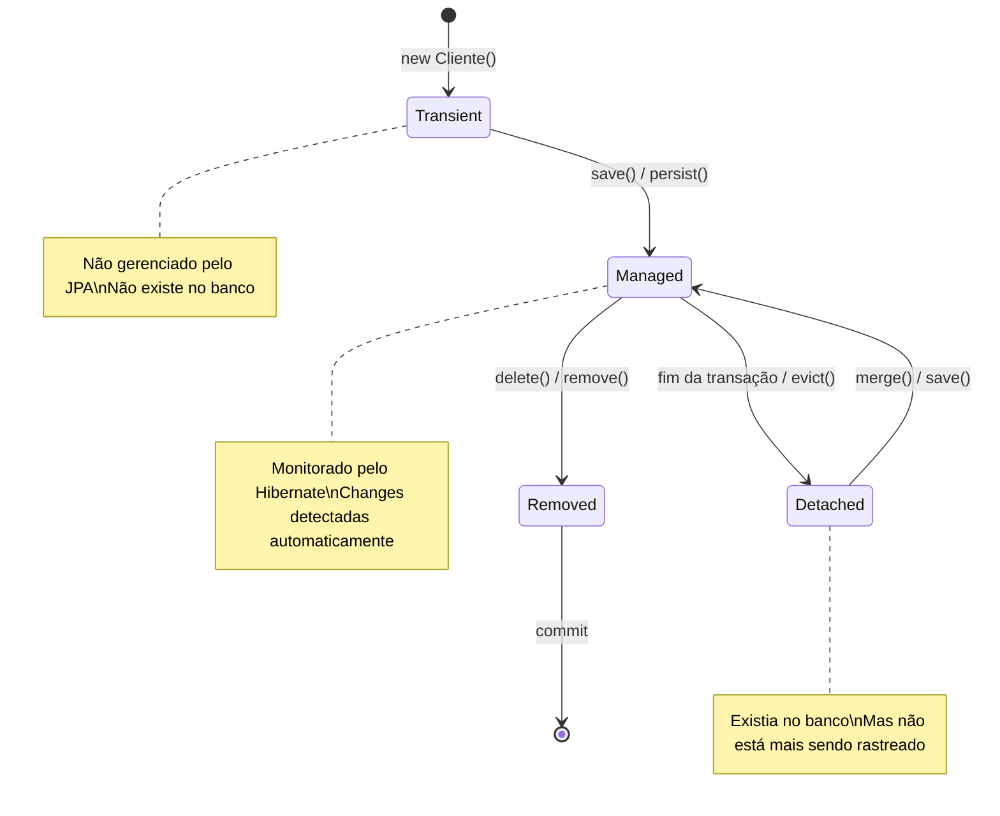

# 21 — JPA e Hibernate Fundamentos

tags: #springboot #jpa #hibernate #persistência
links: [[22 - Entidades e Anotações JPA]] | [[23 - Relacionamentos OneToMany ManyToOne ManyToMany]] | [[24 - JpaRepository e Query Methods]] | [[🗺️ Mapa Principal]]

---

## O que é JPA

**JPA (Jakarta Persistence API)** é uma **especificação** — um conjunto de interfaces e anotações que definem como objetos Java devem ser mapeados para tabelas de banco de dados relacional.

JPA não é uma biblioteca — é um **contrato**. Você escreve código contra a API JPA, e um **provider** (implementação concreta) faz o trabalho pesado.

```
Você escreve:  @Entity, @Id, @Column, @OneToMany  (JPA — especificação)
               EntityManager, TypedQuery

Quem executa:  Hibernate  (provider — implementação)
```

---

## O que é Hibernate

**Hibernate** é a implementação de JPA mais popular do mundo. É ele que:
- Gera o SQL a partir das suas anotações JPA
- Gerencia o cache de primeiro nível (contexto de persistência)
- Controla transações
- Mapeia ResultSet → objetos Java

No Spring Boot, o `spring-boot-starter-data-jpa` já inclui Hibernate automaticamente.

---

## O problema que JPA/Hibernate resolve

Sem JPA, acessar banco em Java é verboso e propenso a erros:

```java
// ❌ JDBC puro — sem JPA
public Cliente buscarPorId(Long id) {
    Connection conn = dataSource.getConnection();
    PreparedStatement stmt = conn.prepareStatement(
        "SELECT id, nome, email, telefone, criado_em FROM clientes WHERE id = ?"
    );
    stmt.setLong(1, id);
    ResultSet rs = stmt.executeQuery();

    if (rs.next()) {
        Cliente cliente = new Cliente();
        cliente.setId(rs.getLong("id"));
        cliente.setNome(rs.getString("nome"));
        cliente.setEmail(rs.getString("email"));
        cliente.setTelefone(rs.getString("telefone"));
        cliente.setCriadoEm(rs.getTimestamp("criado_em").toLocalDateTime());
        return cliente;
    }
    return null;
    // E ainda precisaria fechar conn, stmt, rs em try/finally...
}
```

```java
// ✅ Com JPA/Spring Data — mesma operação
public Optional<Cliente> buscarPorId(Long id) {
    return clienteRepository.findById(id);  // 1 linha
}
```

---

## O contexto de persistência (Persistence Context)

É o conceito mais importante do JPA. O contexto de persistência é um **cache de primeiro nível** que o Hibernate mantém dentro de uma transação.

```java
@Transactional
public void exemplo() {
    // Busca do banco — Hibernate armazena no contexto de persistência
    Cliente cliente = repository.findById(1L).orElseThrow();

    // Modifica o objeto
    cliente.setNome("Novo Nome");

    // NÃO precisa chamar save() — o Hibernate detecta a mudança automaticamente
    // e gera o UPDATE no commit da transação

    // Buscar novamente o mesmo ID retorna o objeto do cache, não do banco
    Cliente mesmoCliente = repository.findById(1L).orElseThrow();
    // mesmoCliente == cliente (mesma instância em memória)
}
// Ao finalizar o método: Hibernate faz flush() → executa os SQLs → commit
```

Este mecanismo chama-se **dirty checking** — Hibernate rastreia quais objetos foram modificados e gera os UPDATEs necessários automaticamente.

---

## Estados de uma entidade JPA



```java
// Transient — objeto novo, não gerenciado
Cliente cliente = new Cliente("Felipe", "felipe@ex.com");
// cliente não existe no banco, JPA não sabe da sua existência

// Managed — persistido e monitorado
cliente = repository.save(cliente);  // INSERT → banco, agora é Managed
// qualquer modificação dentro da transação será detectada

// Detached — depois que a transação termina
// cliente está "solto" — não é mais monitorado
// chamar métodos lazy nele causa LazyInitializationException

// De volta a Managed
cliente = repository.save(cliente);  // se tiver ID, faz MERGE (UPDATE)
```

---

## O papel do Spring Data JPA

Spring Data JPA adiciona uma camada de abstração sobre o JPA:

```
Sua aplicação
     ↓
Spring Data JPA (repositórios, query methods, paginação)
     ↓
JPA (especificação: @Entity, EntityManager, JPQL)
     ↓
Hibernate (implementação: gera SQL, gerencia conexões)
     ↓
JDBC (comunicação com o banco)
     ↓
PostgreSQL / MySQL / H2 (banco de dados)
```

Com Spring Data JPA, você raramente usa `EntityManager` diretamente. As interfaces de repositório geram tudo.

---

## Configuração básica

```yaml
# application.yml
spring:
  datasource:
    url: jdbc:postgresql://localhost:5432/meubanco
    username: postgres
    password: ${DB_PASSWORD}

  jpa:
    hibernate:
      ddl-auto: none      # em produção — usa Flyway para migrations
    show-sql: false        # true só para debug
    open-in-view: false    # IMPORTANTE: desabilite sempre (veja abaixo)
    properties:
      hibernate:
        format_sql: true
        default_schema: public
```

### Por que `open-in-view: false` é importante

O `spring.jpa.open-in-view` está **true por padrão** no Spring Boot — é um antipadrão.

```
open-in-view: true (padrão ruim):
  HTTP Request chega → abre transação → Controller → Service → Repository → fecha transação
  mas mantém conexão aberta até o fim da serialização JSON
  → conexões do pool são mantidas por muito mais tempo
  → sob carga alta, pool de conexões esgota
  → problemas de performance e escalabilidade

open-in-view: false (correto):
  Transação abre e fecha no Service
  Controller recebe objetos já carregados (via DTOs)
  Conexão liberada para o pool assim que a transação fecha
```

---

## Anotações JPA essenciais — visão geral

| Anotação | Onde usar | Para que serve |
|---|---|---|
| `@Entity` | Classe | Marca como entidade JPA → mapeia para tabela |
| `@Table` | Classe | Configura nome da tabela, índices, constraints |
| `@Id` | Campo | Chave primária |
| `@GeneratedValue` | Campo | Estratégia de geração do ID |
| `@Column` | Campo | Configura coluna (nome, nullable, unique, length) |
| `@OneToMany` | Campo | Relacionamento 1:N |
| `@ManyToOne` | Campo | Relacionamento N:1 |
| `@ManyToMany` | Campo | Relacionamento N:N |
| `@JoinColumn` | Campo | Define a coluna de chave estrangeira |
| `@Transient` | Campo | Campo NÃO mapeado para coluna |
| `@Enumerated` | Campo | Mapa enum para coluna |
| `@Lob` | Campo | Campo grande (texto longo, binário) |
| `@PrePersist` | Método | Executado antes do INSERT |
| `@PreUpdate` | Método | Executado antes do UPDATE |

---

## Próximas notas
- [[22 - Entidades e Anotações JPA]] — todas as anotações em detalhe com exemplos
- [[23 - Relacionamentos OneToMany ManyToOne ManyToMany]] — relacionamentos
- [[24 - JpaRepository e Query Methods]] — repositórios e queries automáticas
