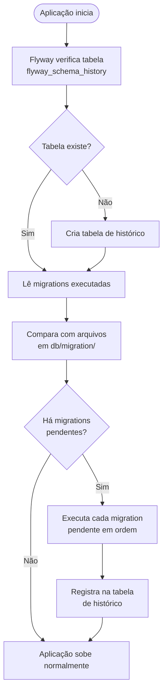

# 27 — Flyway Migrations

tags: #springboot #flyway #banco #migrations
links: [[26 - Configuração de Banco Relacional]] | [[28 - Modelagem de Dados com JPA]] | [[🗺️ Mapa Principal]]

---

## O que é e por que usar

**Flyway** é uma ferramenta de **versionamento e migração de schema** de banco de dados. Ela controla a evolução do seu banco da mesma forma que o Git controla o seu código.

### O problema sem Flyway

```
Sem controle de migrations:
- Dev A adiciona coluna "telefone" no banco local → manda o código
- Dev B faz pull, roda a aplicação → erro: coluna "telefone" não existe no banco dele
- Em produção: deploy novo código → banco antigo sem a coluna → aplicação quebra

Com Flyway:
- Dev A cria V2__add_coluna_telefone.sql
- Dev B faz pull, sobe a aplicação → Flyway detecta migration pendente → executa SQL automaticamente
- Em produção: Flyway roda antes da aplicação subir → schema sempre consistente
```

---

## Como o Flyway funciona



---

## Convenção de nomenclatura dos arquivos

```
V{versão}__{descrição}.sql

V1__create_tables.sql          ← versão 1 — cria tabelas
V2__add_coluna_telefone.sql    ← versão 2 — adiciona coluna
V3__create_index_email.sql     ← versão 3 — cria índice
V4__alter_table_produtos.sql   ← versão 4 — altera tabela
V10__insert_dados_iniciais.sql ← versão 10 — dados iniciais

Regras:
- V maiúsculo
- Versão numérica (pode usar ponto: V1.1, V2.3)
- Dois underscores (__) entre versão e descrição
- Descrição com underscores (sem espaços)
- Sempre .sql
- NUNCA altere um arquivo de migration já executado
```

---

## Configuração

```xml
<!-- pom.xml -->
<dependency>
    <groupId>org.flywaydb</groupId>
    <artifactId>flyway-core</artifactId>
    <!-- versão gerenciada pelo Spring Boot parent -->
</dependency>

<!-- Para PostgreSQL -->
<dependency>
    <groupId>org.flywaydb</groupId>
    <artifactId>flyway-database-postgresql</artifactId>
</dependency>
```

```yaml
# application.yml
spring:
  flyway:
    enabled: true
    locations: classpath:db/migration    # onde ficam os arquivos .sql
    baseline-on-migrate: true            # para bancos que já tinham dados antes do Flyway
    validate-on-migrate: true            # valida checksum dos arquivos antes de rodar
    out-of-order: false                  # não permite V3 rodar antes de V2
    clean-disabled: true                 # NUNCA permite flyway:clean em produção
```

---

## Estrutura de arquivos

```
src/main/resources/
└── db/
    └── migration/
        ├── V1__create_schema_inicial.sql
        ├── V2__add_tabela_categorias.sql
        ├── V3__add_foreign_keys.sql
        ├── V4__create_indexes.sql
        ├── V5__add_coluna_telefone_clientes.sql
        └── V6__insert_categorias_iniciais.sql
```

---

## Exemplos de migrations reais

### V1 — Schema inicial completo

```sql
-- V1__create_schema_inicial.sql

-- Tabela de usuários (para autenticação)
CREATE TABLE usuarios (
    id          BIGSERIAL PRIMARY KEY,
    nome        VARCHAR(150)  NOT NULL,
    email       VARCHAR(200)  NOT NULL UNIQUE,
    senha_hash  VARCHAR(255)  NOT NULL,
    role        VARCHAR(20)   NOT NULL DEFAULT 'USER',
    ativo       BOOLEAN       NOT NULL DEFAULT TRUE,
    criado_em   TIMESTAMP     NOT NULL DEFAULT NOW(),
    atualizado_em TIMESTAMP
);

-- Tabela de clientes
CREATE TABLE clientes (
    id          BIGSERIAL PRIMARY KEY,
    nome        VARCHAR(150)  NOT NULL,
    email       VARCHAR(200)  NOT NULL UNIQUE,
    telefone    VARCHAR(20),
    cpf         VARCHAR(14)   UNIQUE,
    ativo       BOOLEAN       NOT NULL DEFAULT TRUE,
    criado_em   TIMESTAMP     NOT NULL DEFAULT NOW(),
    atualizado_em TIMESTAMP
);

-- Tabela de categorias
CREATE TABLE categorias (
    id          BIGSERIAL PRIMARY KEY,
    nome        VARCHAR(100)  NOT NULL UNIQUE,
    descricao   TEXT,
    ativo       BOOLEAN       NOT NULL DEFAULT TRUE
);

-- Tabela de produtos
CREATE TABLE produtos (
    id              BIGSERIAL       PRIMARY KEY,
    nome            VARCHAR(200)    NOT NULL,
    descricao       TEXT,
    preco           DECIMAL(10, 2)  NOT NULL,
    custo           DECIMAL(10, 2),
    estoque         INTEGER         NOT NULL DEFAULT 0,
    estoque_minimo  INTEGER         NOT NULL DEFAULT 5,
    ativo           BOOLEAN         NOT NULL DEFAULT TRUE,
    categoria_id    BIGINT          REFERENCES categorias(id),
    criado_em       TIMESTAMP       NOT NULL DEFAULT NOW(),
    atualizado_em   TIMESTAMP
);

-- Tabela de pedidos
CREATE TABLE pedidos (
    id          BIGSERIAL       PRIMARY KEY,
    cliente_id  BIGINT          NOT NULL REFERENCES clientes(id),
    status      VARCHAR(20)     NOT NULL DEFAULT 'PENDENTE',
    total       DECIMAL(10, 2)  NOT NULL DEFAULT 0,
    observacao  TEXT,
    criado_em   TIMESTAMP       NOT NULL DEFAULT NOW(),
    atualizado_em TIMESTAMP
);

-- Tabela de itens do pedido
CREATE TABLE itens_pedido (
    id              BIGSERIAL       PRIMARY KEY,
    pedido_id       BIGINT          NOT NULL REFERENCES pedidos(id) ON DELETE CASCADE,
    produto_id      BIGINT          NOT NULL REFERENCES produtos(id),
    quantidade      INTEGER         NOT NULL,
    preco_unitario  DECIMAL(10, 2)  NOT NULL
);
```

### V2 — Índices de performance

```sql
-- V2__create_indexes.sql

-- Índices para queries frequentes
CREATE INDEX idx_clientes_email     ON clientes(email);
CREATE INDEX idx_clientes_ativo     ON clientes(ativo);
CREATE INDEX idx_produtos_categoria ON produtos(categoria_id);
CREATE INDEX idx_produtos_ativo     ON produtos(ativo);
CREATE INDEX idx_pedidos_cliente    ON pedidos(cliente_id);
CREATE INDEX idx_pedidos_status     ON pedidos(status);
CREATE INDEX idx_pedidos_criado_em  ON pedidos(criado_em DESC);
CREATE INDEX idx_itens_pedido       ON itens_pedido(pedido_id);
```

### V3 — Adicionar coluna

```sql
-- V3__add_coluna_cep_clientes.sql

ALTER TABLE clientes
    ADD COLUMN cep         VARCHAR(9),
    ADD COLUMN logradouro  VARCHAR(200),
    ADD COLUMN numero      VARCHAR(10),
    ADD COLUMN bairro      VARCHAR(100),
    ADD COLUMN cidade      VARCHAR(100),
    ADD COLUMN estado      CHAR(2);
```

### V4 — Dados iniciais (seed)

```sql
-- V4__insert_categorias_iniciais.sql

INSERT INTO categorias (nome, descricao) VALUES
    ('Eletrônicos',     'Produtos eletrônicos em geral'),
    ('Periféricos',     'Teclados, mouses, headsets'),
    ('Computadores',    'Desktops e notebooks'),
    ('Smartphones',     'Celulares e tablets'),
    ('Acessórios',      'Cabos, adaptadores e acessórios');
```

### V5 — Alterar constraint

```sql
-- V5__alter_produto_preco_constraint.sql

-- Adicionar constraint de preço mínimo
ALTER TABLE produtos
    ADD CONSTRAINT chk_preco_positivo CHECK (preco > 0),
    ADD CONSTRAINT chk_estoque_nao_negativo CHECK (estoque >= 0);

-- Índice parcial — só produtos ativos (mais eficiente)
CREATE INDEX idx_produtos_ativos_nome
    ON produtos(nome)
    WHERE ativo = true;
```

### V6 — Criar tabela de auditoria

```sql
-- V6__create_tabela_auditoria.sql

CREATE TABLE auditoria_pedidos (
    id          BIGSERIAL   PRIMARY KEY,
    pedido_id   BIGINT      NOT NULL REFERENCES pedidos(id),
    status_de   VARCHAR(20),
    status_para VARCHAR(20) NOT NULL,
    alterado_em TIMESTAMP   NOT NULL DEFAULT NOW(),
    alterado_por VARCHAR(200)
);

-- Trigger para registrar mudanças de status automaticamente
CREATE OR REPLACE FUNCTION registrar_mudanca_status_pedido()
RETURNS TRIGGER AS $$
BEGIN
    IF OLD.status IS DISTINCT FROM NEW.status THEN
        INSERT INTO auditoria_pedidos (pedido_id, status_de, status_para)
        VALUES (NEW.id, OLD.status, NEW.status);
    END IF;
    RETURN NEW;
END;
$$ LANGUAGE plpgsql;

CREATE TRIGGER trg_auditoria_pedido
    AFTER UPDATE ON pedidos
    FOR EACH ROW
    EXECUTE FUNCTION registrar_mudanca_status_pedido();
```

---

## Erros comuns com Flyway

```
❌ ERRO: Checksum mismatch
Causa: você alterou um arquivo .sql que já foi executado
Solução: NUNCA altere migrations executadas. Crie uma nova migration V{N+1}.

❌ ERRO: Migration out of order
Causa: V3 foi criado mas V2 ainda não existe (merge de branch)
Solução: spring.flyway.out-of-order=true (temporariamente)

❌ ERRO: Migration failed
Causa: erro no SQL da migration
Solução: corrigir o SQL + repair: flyway.repair() ou flyway:repair no Maven
```

---

## Próximas notas
- [[28 - Modelagem de Dados com JPA]] — boas práticas de modelagem
- [[29 - Bean Validation]] — validação de dados de entrada
