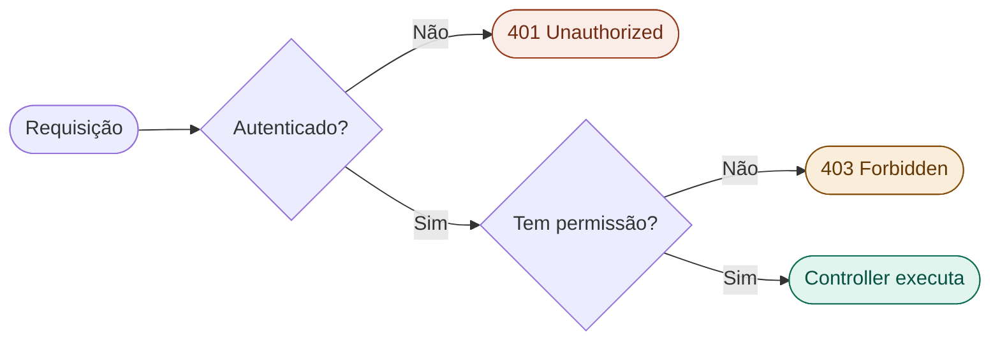
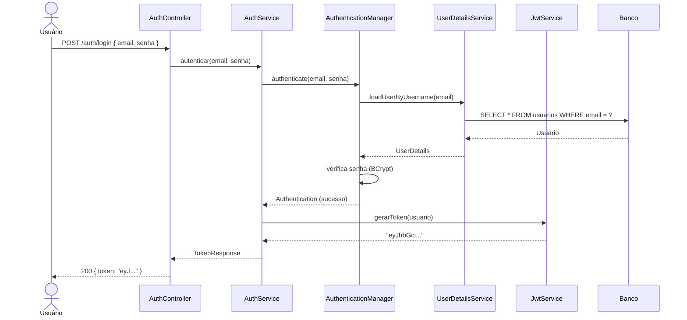

# 36 — Autenticação vs Autorização

tags: #springboot #segurança #autenticação #autorização
links: [[35 - Introdução ao Spring Security]] | [[37 - JWT Conceito e Implementação]] | [[🗺️ Mapa Principal]]

---

## A diferença fundamental

```
Autenticação → "Quem é você?"
               Verificar identidade: login + senha, token JWT, OAuth

Autorização  → "O que você pode fazer?"
               Verificar permissões: você é admin? pode deletar? pode ver este recurso?
```



> **401 Unauthorized** — você não está autenticado (confuso o nome, mas é isso)
> **403 Forbidden** — você está autenticado, mas não tem permissão

---

## Autenticação — o fluxo de login



---

## AuthService — implementação do login

```java
package com.empresa.api.auth;

import com.empresa.api.auth.dto.*;
import com.empresa.api.security.JwtService;
import com.empresa.api.usuario.*;
import org.springframework.security.authentication.*;
import org.springframework.security.core.AuthenticationException;
import org.springframework.security.crypto.password.PasswordEncoder;
import org.springframework.stereotype.Service;
import org.springframework.transaction.annotation.Transactional;

@Service
public class AuthService {

    private final UsuarioRepository usuarioRepository;
    private final PasswordEncoder passwordEncoder;
    private final JwtService jwtService;
    private final AuthenticationManager authenticationManager;

    public AuthService(UsuarioRepository usuarioRepository,
                       PasswordEncoder passwordEncoder,
                       JwtService jwtService,
                       AuthenticationManager authenticationManager) {
        this.usuarioRepository = usuarioRepository;
        this.passwordEncoder = passwordEncoder;
        this.jwtService = jwtService;
        this.authenticationManager = authenticationManager;
    }

    // ===== LOGIN =====
    public AuthResponse login(LoginRequest request) {
        try {
            // AuthenticationManager verifica email + senha
            var authentication = authenticationManager.authenticate(
                new UsernamePasswordAuthenticationToken(
                    request.email(),
                    request.senha()
                )
            );

            // Se chegou aqui, autenticação foi bem-sucedida
            var usuario = (Usuario) authentication.getPrincipal();
            var token = jwtService.gerarToken(usuario);

            return new AuthResponse(
                token,
                jwtService.getExpiracao(),
                UsuarioResponse.from(usuario)
            );

        } catch (BadCredentialsException e) {
            throw new CredenciaisInvalidasException();
        } catch (DisabledException e) {
            throw new ContaDesativadaException();
        }
    }

    // ===== REGISTRO =====
    @Transactional
    public AuthResponse registrar(RegistroRequest request) {

        if (usuarioRepository.existsByEmail(request.email())) {
            throw new RecursoJaExisteException("Usuário", "e-mail", request.email());
        }

        var usuario = new Usuario(
            request.nome(),
            request.email(),
            passwordEncoder.encode(request.senha()),  // hash BCrypt
            Role.USER  // role padrão
        );

        usuarioRepository.save(usuario);
        var token = jwtService.gerarToken(usuario);

        return new AuthResponse(token, jwtService.getExpiracao(), UsuarioResponse.from(usuario));
    }
}
```

---

## AuthController

```java
package com.empresa.api.auth;

import com.empresa.api.auth.dto.*;
import jakarta.validation.Valid;
import org.springframework.http.*;
import org.springframework.web.bind.annotation.*;

@RestController
@RequestMapping("/api/v1/auth")
public class AuthController {

    private final AuthService authService;

    public AuthController(AuthService authService) {
        this.authService = authService;
    }

    @PostMapping("/login")
    public ResponseEntity<AuthResponse> login(@RequestBody @Valid LoginRequest request) {
        return ResponseEntity.ok(authService.login(request));
    }

    @PostMapping("/registro")
    public ResponseEntity<AuthResponse> registrar(@RequestBody @Valid RegistroRequest request) {
        return ResponseEntity.status(HttpStatus.CREATED).body(authService.registrar(request));
    }
}
```

---

## DTOs de autenticação

```java
// Entrada: login
public record LoginRequest(
    @NotBlank @Email String email,
    @NotBlank String senha
) {}

// Entrada: registro
public record RegistroRequest(
    @NotBlank @Size(min = 2, max = 150) String nome,
    @NotBlank @Email String email,
    @NotBlank @Size(min = 8, max = 100) String senha
) {}

// Saída: resposta com token
public record AuthResponse(
    String token,
    long expiracaoEm,       // timestamp Unix de expiração
    UsuarioResponse usuario  // dados do usuário logado
) {}

// Saída: dados do usuário (sem senha!)
public record UsuarioResponse(Long id, String nome, String email, String role) {
    public static UsuarioResponse from(Usuario u) {
        return new UsuarioResponse(u.getId(), u.getNome(), u.getEmail(), u.getRole().name());
    }
}
```

---

## Autorização — controlando o acesso

### Nível de URL (SecurityConfig)

```java
.authorizeHttpRequests(auth -> auth
    // Público
    .requestMatchers("/api/v1/auth/**").permitAll()
    .requestMatchers(HttpMethod.GET, "/api/v1/produtos/**").permitAll()

    // Só ADMIN
    .requestMatchers("/api/v1/admin/**").hasRole("ADMIN")
    .requestMatchers(HttpMethod.DELETE, "/api/v1/**").hasRole("ADMIN")

    // Múltiplas roles
    .requestMatchers("/api/v1/relatorios/**").hasAnyRole("ADMIN", "MODERADOR")

    // Qualquer autenticado
    .anyRequest().authenticated()
)
```

### Nível de método — @PreAuthorize (mais flexível)

```java
// Habilitar em SecurityConfig: @EnableMethodSecurity

@Service
public class PedidoService {

    // Qualquer usuário autenticado
    @PreAuthorize("isAuthenticated()")
    public List<PedidoResponse> listarMeus(Long usuarioId) { ... }

    // Só ADMIN
    @PreAuthorize("hasRole('ADMIN')")
    public List<PedidoResponse> listarTodos() { ... }

    // ADMIN ou MODERADOR
    @PreAuthorize("hasAnyRole('ADMIN', 'MODERADOR')")
    public void cancelar(Long id) { ... }

    // Usuário só acessa seus próprios pedidos
    @PreAuthorize("hasRole('ADMIN') or #usuarioId == authentication.principal.id")
    public PedidoResponse buscar(Long id, Long usuarioId) { ... }
    // #usuarioId referencia o parâmetro do método
    // authentication.principal é o objeto UserDetails do usuário logado
}
```

### Obtendo o usuário logado

```java
// No Controller — pelo @AuthenticationPrincipal
@GetMapping("/meu-perfil")
public ResponseEntity<UsuarioResponse> meuPerfil(
    @AuthenticationPrincipal Usuario usuarioLogado  // Spring injeta automaticamente
) {
    return ResponseEntity.ok(UsuarioResponse.from(usuarioLogado));
}

// No Service — pelo SecurityContextHolder
@Service
public class AlgumService {

    public Usuario getUsuarioLogado() {
        var authentication = SecurityContextHolder.getContext().getAuthentication();
        return (Usuario) authentication.getPrincipal();
    }
}
```

---

## BCrypt — hashing de senhas

```java
// NUNCA armazene senhas em texto puro
// Use BCrypt — algoritmo de hashing com salt automático

@Bean
public PasswordEncoder passwordEncoder() {
    return new BCryptPasswordEncoder();
    // Força padrão = 10 (2^10 = 1024 iterações)
    // Mais alto = mais lento = mais seguro contra brute force
}

// Criando hash:
String hash = passwordEncoder.encode("minhasenha123");
// "$2a$10$N9qo8uLOickgx2ZMRZoMyeIjZAgcfl7p92ldGxad68LJZdL17lhWy"

// Verificando:
boolean valido = passwordEncoder.matches("minhasenha123", hash);  // true
boolean invalido = passwordEncoder.matches("senhaerrada", hash);  // false

// Cada encode gera um hash diferente (salt aleatório)
// Mas matches() sempre funciona corretamente
```

---

## Próximas notas
- [[37 - JWT Conceito e Implementação]] — token JWT completo
- [[38 - Filtros de Segurança]] — o filtro JWT na cadeia de segurança
